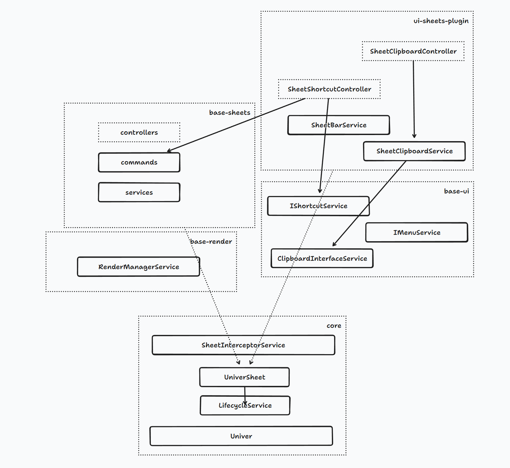

# Univer Sheet Architecture - Univer Sheet 架构

如同在[架构概要](./achitecture.md) 中所提到的，Univer 以插件化的方式来实现各种功能，Univer Sheet 业务逻辑的实现也是通过插件来完成的，本文档将会介绍 Univer Sheet 的架构。

---

## 主要插件以及职责

Univer Sheet 的插件架构如下图所示：

*并未绘制出全部的模块，仅做示意*。

Univer Sheet 的架构主要由以下几个部分组成：

### core

`core` 跟 sheet 相关的模块主要是基数据结构和一个 `SheetInterceptorService`：

* UniverSheet 类型，它负责管理 Sheet 相关的 plugin
* Workbook 类型，它是一个工作簿，包含多个 Worksheet，存储工作簿的元数据
* Worksheet 类型，它是一个工作表，存储每个子表的数据
* `SheetInterceptorService`，允许其他插件干预从 Worksheet 上取值的行为

#### SheetInterceptorService

一个较为特殊的服务，它允许上层业务修改从 Worksheet 中获取单元格数据、获取行列隐藏信息等的操作的结果，以及在特定的 command 执行时补充 mutation 或者 operation。这个服务的主要目的是为了实现一些特殊的功能，例如：

1. sheet 公式
2. sheet 条件格式
3. sheet 数据验证
4. sheet 数据透视表

等等

### base-sheets

base-sheets 子包提供了大量更改 sheet 数据的 command，同时 base-sheets 还负责 canvas 渲染的状态管理和服务。

### ui-plugin-sheets

ui-plugin-sheets 提供了 sheet 的 UI，包括：

* sheet 快捷键
* 复制粘贴逻辑
* sheet 的 UI 组件
* 单元格编辑器
